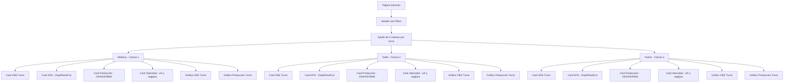

# Plano de Refatoração: Página Informes com Granularidade por Turno

## 🎯 Objetivo
Refazer completamente a página Informes focando em **granularidade por turno**, com layout de 3 colunas lado a lado (Mañana/Tarde/Noche) mostrando dados específicos de cada turno.

## 📊 Estrutura Atual vs Nova

### ❌ Atual (Agregado)
- Dados consolidados de todos os turnos
- KPIs globais
- Gráficos agregados
- Sem distinção visual clara entre turnos

### ✅ Nova (Granular por Turno)
- 3 colunas lado a lado: Mañana | Tarde | Noche
- Cada coluna com dados específicos do turno
- KPIs calculados separadamente por turno
- Gráficos independentes por turno
- Cores e indicadores visuais distintos

## 🏗️ Arquitetura da Nova Página



## 🗂️ Componentes Principais

### 1. **ShiftColumn Component**
```tsx
interface ShiftColumnProps {
  turno: 'Mañana' | 'Tarde' | 'Noche';
  data: TurnoData;
  thresholds: ThresholdData;
  isRealData: boolean;
}

const ShiftColumn = ({ turno, data, thresholds, isRealData }) => (
  <div className="col-lg-4 mb-4">
    <div className="card border-left-primary">
      <div className="card-header bg-primary text-white">
        <h5 className="mb-0">
          <i className="fas fa-clock me-2"></i>
          {turno}
          {!isRealData && <span className="badge bg-warning ms-2">Demo</span>}
        </h5>
      </div>
      <div className="card-body">
        {/* Cards específicos do turno */}
      </div>
    </div>
  </div>
);
```

### 2. **KPICard Component**
```tsx
const KPICard = ({ title, value, unit, color, threshold }) => (
  <div className="card mb-3">
    <div className="card-body text-center">
      <h6 className="text-muted">{title}</h6>
      <h3 className={`text-${color}`}>{value}{unit}</h3>
      {threshold && <small className="text-muted">Objetivo: {threshold}%</small>}
    </div>
  </div>
);
```

### 3. **ShiftChart Component**
```tsx
const ShiftChart = ({ turno, oeeData, productionData }) => (
  <div className="card mb-3">
    <div className="card-header">
      <h6 className="mb-0">OEE - {turno}</h6>
    </div>
    <div className="card-body">
      <ResponsiveContainer width="100%" height={200}>
        <BarChart data={oeeData}>
          <XAxis dataKey="hora" />
          <YAxis domain={[0, 100]} />
          <Tooltip />
          <Bar dataKey="oee" fill="#28a745" />
          <ReferenceLine y={65} stroke="#ffc107" />
        </ResponsiveContainer>
      </ResponsiveContainer>
    </div>
  </div>
);
```

## 🎨 Layout Visual

### Design System
- **Mañana**: Azul (#007bff) - turno matutino
- **Tarde**: Laranja (#fd7e14) - turno vespertino
- **Noche**: Roxo (#6f42c1) - turno noturno
- **Demo Mode**: Badge amarelo com indicador visual

### Responsividade
- **Desktop**: 3 colunas lado a lado (col-lg-4)
- **Tablet**: 2 colunas por linha, 1 na segunda (col-md-6)
- **Mobile**: 1 coluna por vez com navegação por turno

## 📡 API Contract

### Request
```
GET /api/informes?ordenFabricacion={OF}&fechaInicio={date}&fechaFin={date}
```

### Response (Granular por Turno)
```json
{
  "success": true,
  "hasRealData": true,
  "turnos": [
    {
      "turno": "MAÑANA",
      "oee": 85.5,
      "rendimiento": 88.2,
      "disponibilidad": 92.1,
      "calidad": 94.3,
      "piezas_ok": 245,
      "piezas_nok": 12,
      "piezas_rwk": 5,
      "tiempo_prod_s": 7200,
      "tiempo_paro_s": 800,
      "velocidad_uh": 122.5,
      "velocidad_seg_pza": 29.4,
      "operadores": 2,
      "paradas": { "pp": 5, "pnp": 3, "pcalidad": 1 },
      "oee_historico": [
        {"hora": "06:00", "oee": 82.3},
        {"hora": "07:00", "oee": 85.1},
        {"hora": "08:00", "oee": 88.9}
      ]
    },
    {
      "turno": "TARDE",
      "oee": 78.8,
      "rendimiento": 85.5,
      "disponibilidad": 89.2,
      "calidad": 91.7,
      // ... dados específicos do turno da tarde
    },
    {
      "turno": "NOCHE",
      "oee": 82.1,
      "rendimiento": 87.3,
      "disponibilidad": 90.8,
      "calidad": 93.2,
      // ... dados específicos do turno da noite
    }
  ],
  "thresholds": {
    "verde": 85,
    "naranja": 70
  }
}
```

## 🔧 Implementação Técnica

### 1. **Queries SQL por Turno**
```sql
-- Dados por turno com granularidade horária
SELECT
  DATEPART(HOUR, hp.Fecha_ini) as hora,
  CASE
    WHEN DATEPART(HOUR, hp.Fecha_ini) >= 6 AND DATEPART(HOUR, hp.Fecha_ini) < 14 THEN 'MAÑANA'
    WHEN DATEPART(HOUR, hp.Fecha_ini) >= 14 AND DATEPART(HOUR, hp.Fecha_ini) < 22 THEN 'TARDE'
    ELSE 'NOCHE'
  END as turno,
  -- KPIs calculados por hora
  AVG(cm.Ag_Rt_OEE_Turno) as oee,
  SUM(hp.Unidades_ok) as piezas_ok,
  SUM(hp.Unidades_nok) as piezas_nok,
  SUM(hp.Unidades_repro) as piezas_rwk
FROM cfg_maquina cm
LEFT JOIN his_fase hf ON cm.Rt_Id_his_fase = hf.Id_his_fase
LEFT JOIN his_prod hp ON hf.Id_his_fase = hp.Id_his_fase
WHERE cm.Rt_Cod_of = ?
  AND hp.Fecha_ini >= ?
  AND hp.Fecha_fin <= ?
GROUP BY DATEPART(HOUR, hp.Fecha_ini)
ORDER BY hora;
```

### 2. **Estado da Aplicação**
```tsx
interface AppState {
  selectedOF: string;
  fechaDesde: string;
  fechaHasta: string;
  turnoAtivo: 'MAÑANA' | 'TARDE' | 'NOCHE' | null; // Para mobile
  data: DashboardData | null;
  loading: boolean;
  error: string | null;
  isRealData: boolean;
}
```

### 3. **Hook de Dados**
```tsx
const useDashboardData = (of: string, desde: string, hasta: string) => {
  const [data, setData] = useState<DashboardData | null>(null);
  const [loading, setLoading] = useState(false);
  const [error, setError] = useState<string | null>(null);

  useEffect(() => {
    if (!of) return;

    const fetchData = async () => {
      setLoading(true);
      try {
        const response = await fetch(
          `/api/informes?ordenFabricacion=${of}&fechaInicio=${desde}&fechaFin=${hasta}`
        );
        const result = await response.json();

        if (result.success) {
          setData(result);
          setError(null);
        } else {
          throw new Error(result.error);
        }
      } catch (err) {
        setError(err.message);
        setData(null);
      } finally {
        setLoading(false);
      }
    };

    fetchData();
  }, [of, desde, hasta]);

  return { data, loading, error };
};
```

## ✅ Critérios de Aceitação

### Funcionalidades Principais
- [ ] 3 colunas lado a lado mostrando dados de cada turno
- [ ] KPIs calculados separadamente por turno
- [ ] Gráficos independentes por turno
- [ ] Indicadores visuais claros de dados reais vs demo
- [ ] Responsividade em desktop/tablet/mobile
- [ ] Atualização automática de dados

### Performance
- [ ] Carregamento rápido (< 2s)
- [ ] Dados cacheados quando apropriado
- [ ] Queries otimizadas por turno

### UX/UI
- [ ] Cores distintas por turno
- [ ] Navegação intuitiva
- [ ] Feedback visual de loading/states
- [ ] Acessibilidade (ARIA labels, foco)

### Dados
- [ ] Queries retornam dados granulares por turno
- [ ] Fallback elegante quando não há dados
- [ ] Thresholds dinâmicos por máquina
- [ ] Cálculos OEE corretos: Disponibilidad × Rendimiento × Calidad

## 🚀 Próximos Passos

1. **Aprovação do plano** - O usuário confirma se está de acordo
2. **Mudar para modo Code** - Implementar a refatoração
3. **Desenvolver componentes** - Começar pelos cards por turno
4. **Implementar API** - Garantir dados granulares
5. **Testes** - Validar com dados reais e demo
6. **Deploy** - Página pronta para produção

---

**Este plano aborda completamente a necessidade de granularidade por turno, transformando a página de dados agregados para uma visualização clara e específica de cada turno de produção.**